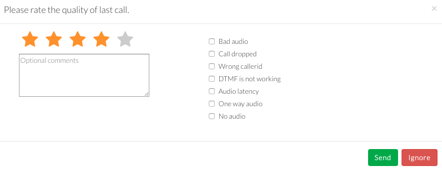

## Plivo Web SDK v2.0 Example
##### We have come up with simple webphone here!
*This is a very simple demo showing how you can make phone calls from the web browser to both sip addresses and PSTN phone numbers without installing any plugin.*

#

---
*Checkout [live web phone demo](https://s3.amazonaws.com/plivowebrtc/v2-0.html) 
To use the live demo, please sign up for a Plivo account here: https://manage.plivo.com/accounts/register/ then make a Plivo Endpoint here: https://manage.plivo.com/endpoint/create/. You must use a Plivo Endpoint to log into the WebSDK demo page. Please do not try to use your Plivo account credentials to log into the demo.*

---
### Install

```
git checkout https://github.com/plivo/plivo-websdk-2.0-example.git
npm install
npm start
```

### Output
```
Our app is running on http://localhost:8080
```
### Usage
> Always include Plivo lib file  in the `<body>` tag and then include your custom wrapper client

##### You always have a choice to design your own phone client but this is just a quick kiskstart
Lets create a `customclient.js` file and declare a variable `var plivoWebSdk;` 
This is where we initialise a new Plivo object by passing `options` like `plivoWebSdk = new window.Plivo(options);`
a `startPhone` function to hook all our Events
```js
    var plivoWebSdk; 
    function startPhone(username, password){
        if(!username) return;
        var options = refreshSettings();
            plivoWebSdk = new window.Plivo(options);
        plivoWebSdk.client.on('onWebrtcNotSupported', onWebrtcNotSupported);
        plivoWebSdk.client.on('onLogin', onLogin);
        plivoWebSdk.client.on('onLogout', onLogout);
        plivoWebSdk.client.on('onLoginFailed', onLoginFailed);
        plivoWebSdk.client.on('onCallRemoteRinging', onCallRemoteRinging);
        plivoWebSdk.client.on('onIncomingCallCanceled', onIncomingCallCanceled);
        plivoWebSdk.client.on('onCallFailed', onCallFailed);
        plivoWebSdk.client.on('onCallAnswered', onCallAnswered);
        plivoWebSdk.client.on('onCallTerminated', onCallTerminated);
        plivoWebSdk.client.on('onCalling', onCalling);
        plivoWebSdk.client.on('onIncomingCall', onIncomingCall);
        plivoWebSdk.client.on('onMediaPermission', onMediaPermission);
        plivoWebSdk.client.on('mediaMetrics',mediaMetrics);
        //Show screen loader and other UI stuffs
        kickStartNow();
        // Allow to set default ring tones
        plivoWebSdk.client.setRingTone(true);
        plivoWebSdk.client.setRingToneBack(true);
        login(username, password);
    }
```
We have access to `options` from UI as SETTINGS menu. You can update your settings in the UI and click on LOGIN to boot the phone.
### Document ready state

>If you are directly calling login on page load, Please make sure you do that on only document ready*

```html
    <script type="text/javascript">
        $( document ).ready(function() {
            console.log( "HTML ready!" );
            resetSettings(); // always reset your settings on page load
            refreshSettings(); // try to bring up if any settings that are saved locally
        }); 
    </script>
```
### Login 
login starts off with accepting Plivo Endpoint Credentials in login menu
#
```js
    function login(username, password) {
        if(username){
          plivoWebSdk.client.login(username, password);
        }
    }
    $('#clickLogin').click(function(e){
      var userName = $('#loginUser').val();
      var password = $('#loginPwd').val();
      startPhone(userName, password);
    });  
```    
### Settings part
*This code will help you to play witht `options` params directly in UI, but in your production env, you can hard code your `options` param*
#

```js
function resetSettings(source){
  var defaultSettings = { "debug": "DEBUG", "permOnClick": true, "codecs": ["OPUS","PCMU"], "enableIPV6": false, "audioConstraints": { "optional": [ { "googAutoGainControl": false } ] }, "enableTracking": false}
  var uiSettings = document.querySelector('#appSettings');
  uiSettings.value = JSON.stringify(defaultSettings);
  if(source == 'clickTrigger')
    localStorage.removeItem('plivosettings');
}

function refreshSettings(){
  var getSettings = localStorage.getItem('plivosettings');
  var uiSettings = document.querySelector('#appSettings');
  if(getSettings){
    uiSettings.value = getSettings;
    return JSON.parse(getSettings);
  }else{
    return JSON.parse(uiSettings.value);
  }
}
function updateSettings(val){
  localStorage.setItem('plivosettings',val);
  console.log('plivosettings updated!')
}
// From UI triggers
$('#updateSettings').click(function(e){
  var appSettings = document.querySelector('#appSettings'); 
  appSettings = appSettings.value;
  updateSettings(appSettings);
});

$('#resetSettings').click(function(e){
  resetSettings('clickTrigger');
});    
```    
### Registering
Registration related events that need to be handled
```js
function onReady(){
  $('#phonestatus').html('trying to login...');
  console.info('Ready');
}
function onLogin(){
  $('#phonestatus').html('online');
  console.info('Logged in');
  $('#makecall').attr('class', 'btn btn-success btn-block flatbtn');
  $('#uiLogin').hide();
  $('#uiLogout').show();
  $('.feedback').show();
}
function onLoginFailed(reason){
  $('#phonestatus').html('login failed');
  console.info('onLoginFailed ',reason);
  customAlert('Login failure :',reason);  
}
function onLogout(){
  $('#phonestatus').html('Offline');
  console.info('onLogout');
}
```    
### Making a call
Enter the number or sip uri in the post login UI and click the call button. This action causes the following code to run
```js
$('#makecall').click(function(e){
  var to = $('#toNumber').val().replace(" ","");
  var callEnabled = $('#makecall').attr('class').match('disabled');
  if(!to || !plivoWebSdk || !!callEnabled){return};
  console.info('Click make call : ',to);
  $('.callScreen').show();
  $('.AfterAnswer').show();
  plivoWebSdk.client.call(to);
  $('#boundType').html('Outgoing :');
  $('#callNum').html(to);
  $('#callDuration').html('00:00:00');
  $('.callinfo').show();
});
```
### Handling Incoming calls
By creating the onIncomingCall listener, the plivoWebSdk object can handle calls coming into the Plivo Endpoint. 
```js
function onIncomingCall(callerName, extraHeaders){
  console.info(callerName, extraHeaders);
  $('#boundType').html('Incomming :');
  $('#callNum').html(callerName);
  $('#callDuration').html('00:00:00');
  $('.callinfo').show();
  $('.callScreen').show();
  $('.inboundBeforeAnswer').show();
}
function onIncomingCallCanceled(){
  console.info('onIncomingCallCanceled');
  callOff();
}

/**
The UI which shows an incoming call is rendered with the above code. The two actions that can be performed now are answer or reject. The code for answering looks like this.
*/
$('#inboundAccept').click(function(){
  console.info('Call accept clicked');
  plivoWebSdk.client.answer();
  $('.inboundBeforeAnswer').hide();
  $('.AfterAnswer').show();
});
```
The reject code looks like this
```js
$('#inboundReject').click(function(){
  console.info('callReject');
  plivoWebSdk.client.reject();
});
```

### Terminating a call
This code may be used to terminate a call. 
```js
$('#Hangup').click(function(){
  console.info('Hangup');
  if(plivoWebSdk.client.callSession){
    plivoWebSdk.client.hangup();
  }else{
    callOff();
  }
});
```
### Hangup calls on page reload / close 
*this will prevent dead calls on the other leg*
Setup an unload listener 
```js
window.onbeforeunload = function () {
  plivoWebSdk.client.hangup();
}; 
```
### Implementing MediaMetrics

A simple dynamic UI to show notifications when some `warning` events get emitted from Plivo SDK
#

Please watch chrome or firefox debugger console to see the comple info during call
```js
function mediaMetrics(obj){
  sessionStorage.setItem('triggerFB',true);
  console.table([obj]);
  var message = obj.type;
  var classExist = document.querySelector('.-'+obj.type);
  if(obj.type.match('audio') && obj.value > 30){
    message = "same level";
  }
  if(obj.active){
    classExist? classExist.remove() : null; 
  $(".alertmsg").prepend(
    '<div class="metrics -'+obj.type+'">' +
    '<span style="margin-left:20px;">'+obj.level+' | </span>' +
    '<span style="margin-left:20px;">'+obj.group+' | </span>' +
    '<span style="margin-left:20px;">'+message+' - '+obj.desc+' : </span><span >'+obj.value+'</span>'+
    '<span aria-hidden="true" onclick="closeMetrics(this)" style="margin-left:25px;cursor:pointer;">X</span>' +
    '</div>'
  );
  }
  if(!obj.active && classExist){
    document.querySelector('.-'+obj.type).remove();
  }
}
```
### Sending Feedback
There is a predefined list of feedback comments shown in UI for the score range from 1-3
Score 4 and 5 can have good and perfect as its comments.
#

```js
$('#sendFeedback').click(function(){
  var score = $('#qualityRange').val();
  var lastCallid = plivoWebSdk.client.getLastCallUUID();
  var comment = $("input[type=radio][name=callqualityradio]:checked").val() || "good";
  score = Number(score);
  plivoWebSdk.client.sendQualityFeedback(lastCallid,score,comment);
  customAlert('Quality feedback','success');
});
```    
    
