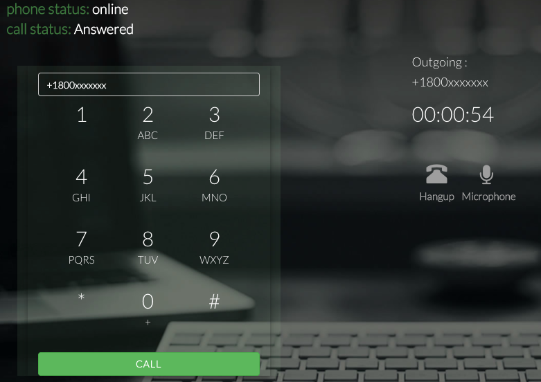
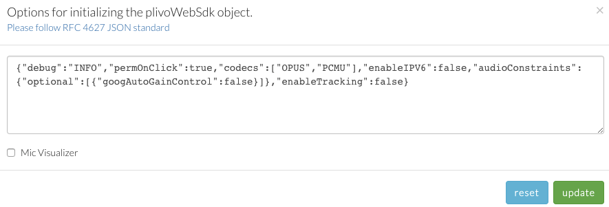

## Plivo Web SDK v2.0 Example
*This Plivo example shows how to use all the features in Plivo WebSDK 2.0 using a simple webphone demo. This demo helps in making phone calls from web browser to both sip addresses and PSTN phone numbers without installing any plugins.*

#

---
*To use the [live web phone demo](https://s3.amazonaws.com/plivowebrtc/v2-0.html) 
a. Sign up for a Plivo account here: https://manage.plivo.com/accounts/register/ 
b. Create a Plivo Endpoint here: https://manage.plivo.com/endpoint/create/. 
c. Use this Plivo endpoint to login after deploying the application*

---
### Deploying the application

```
git checkout https://github.com/plivo/plivo-websdk-2.0-example.git
npm install
npm start
```

### Initialization
> Include plivowebsdk-2.0-stable.min.js in the <body> tag before you include other javascript files dependent on the SDK. 

Lets create a `customclient.js` file and declare a variable `var plivoWebSdk;`
This is where we initialise a new Plivo object by passing `options` as `plivoWebSdk = new window.Plivo(options);`. The application can set up listeners for events as shown in the `startPhone` function below. 

```js
    var plivoWebSdk; 
    function startPhone(username, password){
        if(!username) return;
        var options = refreshSettings();
            plivoWebSdk = new window.Plivo(options);
        plivoWebSdk.client.on('onWebrtcNotSupported', onWebrtcNotSupported);
        plivoWebSdk.client.on('onLogin', onLogin);
        plivoWebSdk.client.on('onLogout', onLogout);
        plivoWebSdk.client.on('onLoginFailed', onLoginFailed);
        plivoWebSdk.client.on('onCallRemoteRinging', onCallRemoteRinging);
        plivoWebSdk.client.on('onIncomingCallCanceled', onIncomingCallCanceled);
        plivoWebSdk.client.on('onCallFailed', onCallFailed);
        plivoWebSdk.client.on('onCallAnswered', onCallAnswered);
        plivoWebSdk.client.on('onCallTerminated', onCallTerminated);
        plivoWebSdk.client.on('onCalling', onCalling);
        plivoWebSdk.client.on('onIncomingCall', onIncomingCall);
        plivoWebSdk.client.on('onMediaPermission', onMediaPermission);
        plivoWebSdk.client.on('mediaMetrics',mediaMetrics);
        //Show screen loader and other UI stuffs
        kickStartNow();
        // Allow to set default ring tones
        plivoWebSdk.client.setRingTone(true);
        plivoWebSdk.client.setRingToneBack(true);
        login(username, password);
    }
```
In the demo, `options` can be set from UI in the SETTINGS menu. Once the SETTINGS is updated clicking on LOGIN will boot the phone again.

### Document ready state

>If you're directly calling login on page load, please make sure you do that only after HTML document ready. 

```html
    <script type="text/javascript">
        $( document ).ready(function() {
            console.log( "HTML ready!" );
            resetSettings(); // always reset your settings on page load
            refreshSettings(); // try to bring up if any settings that are saved locally
        }); 
    </script>
```
### Login 
Login accepts Plivo Endpoint Credentials. 
#
```js
    function login(username, password) {
        if(username){
          plivoWebSdk.client.login(username, password);
        }
    }
    $('#clickLogin').click(function(e){
      var userName = $('#loginUser').val();
      var password = $('#loginPwd').val();
      startPhone(userName, password);
    });  
```    
### Options
*Options allow to disable tracking, setting codec type, enabling and disabling AEC/AGC etc. The list of all the settings can be found in the documentation page.*
#

```js
function resetSettings(source){
  var defaultSettings = { "debug": "DEBUG", "permOnClick": true, "codecs": ["OPUS","PCMU"], "enableIPV6": false, "audioConstraints": { "optional": [ { "googAutoGainControl": false } ] }, "enableTracking": false}
  var uiSettings = document.querySelector('#appSettings');
  uiSettings.value = JSON.stringify(defaultSettings);
  if(source == 'clickTrigger')
    localStorage.removeItem('plivosettings');
}

function refreshSettings(){
  var getSettings = localStorage.getItem('plivosettings');
  var uiSettings = document.querySelector('#appSettings');
  if(getSettings){
    uiSettings.value = getSettings;
    return JSON.parse(getSettings);
  }else{
    return JSON.parse(uiSettings.value);
  }
}
function updateSettings(val){
  localStorage.setItem('plivosettings',val);
  console.log('plivosettings updated!')
}
// From UI triggers
$('#updateSettings').click(function(e){
  var appSettings = document.querySelector('#appSettings'); 
  appSettings = appSettings.value;
  updateSettings(appSettings);
});

$('#resetSettings').click(function(e){
  resetSettings('clickTrigger');
});    
```    
### Registration
The following snippet shows how to handle registration related events in the application
```js
function onReady(){
  $('#phonestatus').html('trying to login...');
  console.info('Ready');
}
function onLogin(){
  $('#phonestatus').html('online');
  console.info('Logged in');
  $('#makecall').attr('class', 'btn btn-success btn-block flatbtn');
  $('#uiLogin').hide();
  $('#uiLogout').show();
  $('.feedback').show();
}
function onLoginFailed(reason){
  $('#phonestatus').html('login failed');
  console.info('onLoginFailed ',reason);
  customAlert('Login failure :',reason);  
}
function onLogout(){
  $('#phonestatus').html('Offline');
  console.info('onLogout');
}
```    
### Outgoing call
Given a number or SIP URI, this snippet shows how to make an outgoing call. The following snippet takes input from the dial pad UI. 
```js
$('#makecall').click(function(e){
  var to = $('#toNumber').val().replace(" ","");
  var callEnabled = $('#makecall').attr('class').match('disabled');
  if(!to || !plivoWebSdk || !!callEnabled){return};
  console.info('Click make call : ',to);
  $('.callScreen').show();
  $('.AfterAnswer').show();
  plivoWebSdk.client.call(to);
  $('#boundType').html('Outgoing :');
  $('#callNum').html(to);
  $('#callDuration').html('00:00:00');
  $('.callinfo').show();
});
```
### Handling Incoming calls
By creating the `onIncomingCall` listener, the `plivoWebSdk` object can handle incoming calls to the Plivo Endpoint.

```js
function onIncomingCall(callerName, extraHeaders){
  console.info(callerName, extraHeaders);
  $('#boundType').html('Incomming :');
  $('#callNum').html(callerName);
  $('#callDuration').html('00:00:00');
  $('.callinfo').show();
  $('.callScreen').show();
  $('.inboundBeforeAnswer').show();
}
function onIncomingCallCanceled(){
  console.info('onIncomingCallCanceled');
  callOff();
}
```
The following snippet shows how to answer an incoming call
```
$('#inboundAccept').click(function(){
  console.info('Call accept clicked');
  plivoWebSdk.client.answer();
  $('.inboundBeforeAnswer').hide();
  $('.AfterAnswer').show();
});
```
The following snippet shows how to reject an incoming call
```js
$('#inboundReject').click(function(){
  console.info('callReject');
  plivoWebSdk.client.reject();
});
```
### Terminating a call
This code may be used to terminate a call. 
```js
$('#Hangup').click(function(){
  console.info('Hangup');
  if(plivoWebSdk.client.callSession){
    plivoWebSdk.client.hangup();
  }else{
    callOff();
  }
});
```
### Hangup calls on page reload or close 
This snippet will hangup existing calls when page is refreshed or closed. 
 
```js
window.onbeforeunload = function () {
  plivoWebSdk.client.hangup();
}; 
```
### Implementing MediaMetrics

This snippet shows how to handle network or media related events from the SDK. A simple dynamic UI to show notifications when some warning events get emitted from Plivo SDK

#

Please check Chrome or Firefox console to see the complete info of the event. 
```js
function mediaMetrics(obj){
  sessionStorage.setItem('triggerFB',true);
  console.table([obj]);
  var message = obj.type;
  var classExist = document.querySelector('.-'+obj.type);
  if(obj.type.match('audio') && obj.value > 30){
    message = "same level";
  }
  if(obj.active){
    classExist? classExist.remove() : null; 
  $(".alertmsg").prepend(
    '<div class="metrics -'+obj.type+'">' +
    '<span style="margin-left:20px;">'+obj.level+' | </span>' +
    '<span style="margin-left:20px;">'+obj.group+' | </span>' +
    '<span style="margin-left:20px;">'+message+' - '+obj.desc+' : </span><span >'+obj.value+'</span>'+
    '<span aria-hidden="true" onclick="closeMetrics(this)" style="margin-left:25px;cursor:pointer;">X</span>' +
    '</div>'
  );
  }
  if(!obj.active && classExist){
    document.querySelector('.-'+obj.type).remove();
  }
}
```
### Sending Feedback
The following snippet shows how to collect feedback using the SDK. There is a predefined list of feedback comments that users can select for the score range from 1-3. In this application we are taking “good” and “perfect” as feedback for scores 4 and 5.
#

```js
$('#sendFeedback').click(function(){
  var score = $('#qualityRange').val();
  var lastCallid = plivoWebSdk.client.getLastCallUUID();
  var comment = $("input[type=radio][name=callqualityradio]:checked").val() || "good";
  score = Number(score);
  plivoWebSdk.client.sendQualityFeedback(lastCallid,score,comment);
  customAlert('Quality feedback','success');
});
```